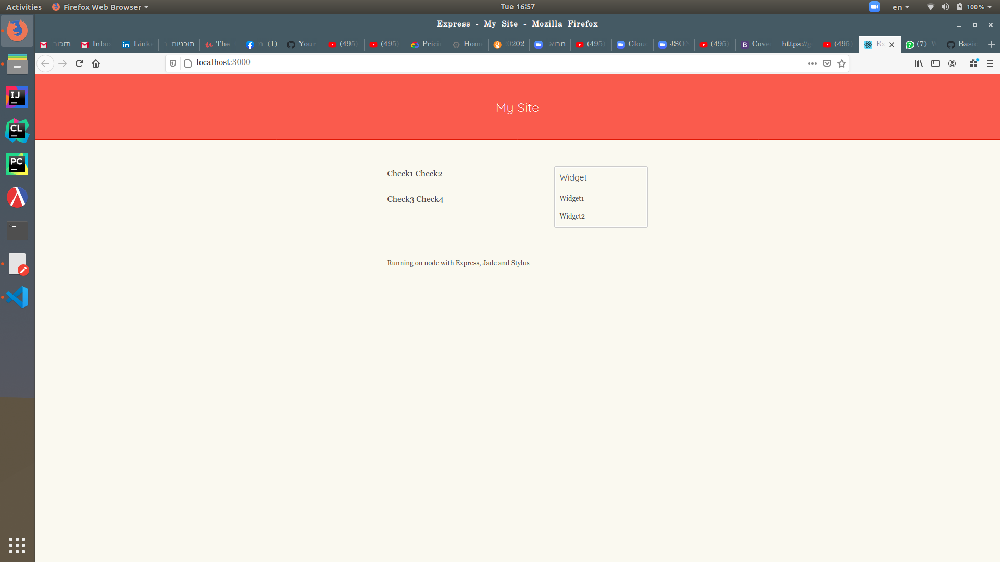

# HackBGU

Run npm install inside server folder to install dependencies

Run the bin/www.js file to start the server

Change public/stylesheets/style.css for the colors of the page

Change views/error.jade views/index.jade views/layout.jade for all the written stuff

After successfully installing dependencies and running bin/www.js you should see:

